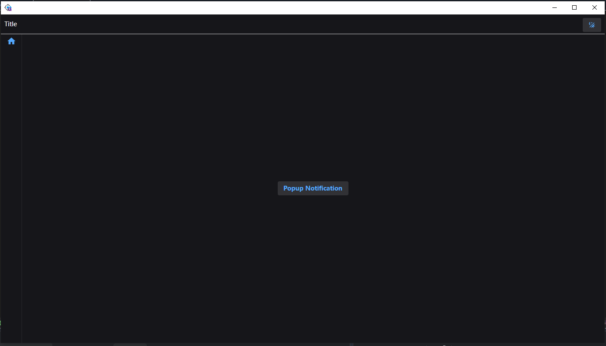
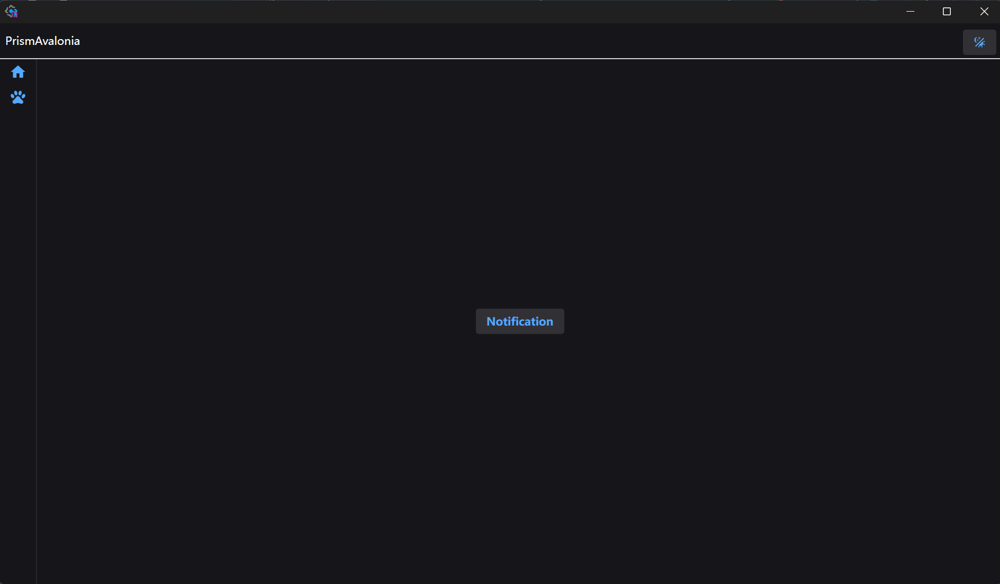

### Introduction
Hi,I am Ouse,Welcome to visit this repository.It is an avalonia tempalte with some nuget packges.  
if you have  asp.net core development experience,I think you want use msdi,because a lot of nugets like EFCore,Logging privider extension methods for SerivceCollection.
### Usage process
1. ```Open terminal```
1. Type```dotnet new install PrismAvaloniaWithMSDI```
1. ```dotnet new PrismAvaloniaWithMSDI -n YourProjecName```
1. ```cd YourProjectName```
1. Execute```dotnet run```  

**Tip:you can also create template in VisualStudio with friendly UI.**
### Features
1. Prism.Avalonia
2. MSDI(Microsoft DI)
3. Semi.Avalonia
4. MS Logging  
5. Basic UI with RegionManager
```xml
  <ItemGroup>
    <PackageReference Include="Avalonia" Version="11.3.10" />
    <PackageReference Include="Avalonia.Desktop" Version="11.3.10" />
    <PackageReference Include="Avalonia.Fonts.Inter" Version="11.3.10" />
    <!--Condition below is needed to remove Avalonia.Diagnostics package from build output in Release configuration.-->
    <PackageReference Condition="'$(Configuration)' == 'Debug'" Include="Avalonia.Diagnostics" Version="11.3.10" />
    <PackageReference Include="DryIoc.Microsoft.DependencyInjection" Version="6.2.0" />
    <PackageReference Include="Material.Icons.Avalonia" Version="2.4.1" />
    <PackageReference Include="Prism.Avalonia" Version="9.0.537.11130" />
    <PackageReference Include="Prism.DryIoc.Avalonia" Version="9.0.537.11130" />
    <PackageReference Include="Semi.Avalonia" Version="11.3.7.1" />
    <PackageReference Include="Serilog" Version="4.3.0" />
    <PackageReference Include="HotAvalonia" Version="3.0.2" />
    <PackageReference Include="Serilog.Extensions.Logging" Version="10.0.0" />
    <PackageReference Include="Serilog.Sinks.File" Version="7.0.0" />
    <PackageReference Include="Xaml.Behaviors.Avalonia" Version="11.3.9" />
  </ItemGroup>
  ```
### Some codesnippet below.  
Popular serviceCollection to dryioc
``` csharp
  protected override void RegisterTypes(IContainerRegistry containerRegistry)
        {

            Log.Logger = new LoggerConfiguration().MinimumLevel.Debug()
                .WriteTo.File("logs/log.txt", rollingInterval: RollingInterval.Day)
                .CreateLogger();

            var serviceColllection = new ServiceCollection();
            serviceColllection.AddSingleton<INotificationService, NotificationService>();
            //Logging
            serviceColllection.AddLogging(builder =>
            {
                builder.AddSerilog(dispose: true);
            });

            //Pupulate ServiceCollection To DryIoc
            containerRegistry.GetContainer().Populate(serviceColllection);

            // Register you Services, Views, Dialogs, etc.
        }
```
NotificationService
```csharp
{
    internal interface INotificationService
    {
        int NotificationTimeout { get; set; }
        void SetHostWindow(TopLevel window);
        void Show(string title, string message, Action? onClick = null, NotificationType type = NotificationType.Information, int? timeoutSeconds = null);
        void ShowInfo(string title, string message, Action? onClick = null);
        void ShowWarning(string title, string message, Action? onClick = null);
        void ShowError(string title, string message, Action? onClick = null);
        void ShowSuccess(string title, string message, Action? onClick = null);
    }
```
EnableCompressionInSingleFile  

### Showcases
<div style="display:flex; gap:16px;">
  
  
</div>  

### End
Thank you for reading.If you have any questions,just let me know.Contact£º2216528769@qq.com.